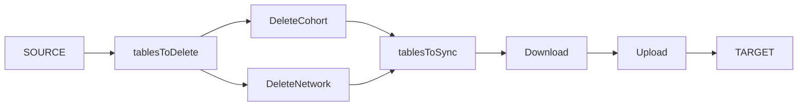

# Jobs

We use the following jobs to migrate data from SOURCE to TARGET:
> [FillStaging](#fillstaging), [SharedStaging](#sharedstaging), CohortStagingToDataCatalogue, NetworkStagingToDataCatalogue, DataCatalogueToNetworkStaging, UMCGCohorts

Data is stored in molgenis EMX2 schema's and depending on the job strategy different Flows ([A](#flow-a)/[B](#flow-b)) are used.

*Flow a*

*Flow b*

EMX2 schemas use predefined datamodels like:
> data-catalogue, cohort-model, network-model, shared-staging, shared-staging-umcg

NOTE: include versioning of data models

These flows have the following steps:
> tablesToSync, tablesToSync, deleteCohort, deleteNetwork, download, filter, upload

## Job strategies

### FillStaging

The goal of *FillStaging* is to migrate data from a data-catalogue model to an **empty** cohort-model, flow A is used.

SOURCE is either [data-catalogue.molgeniscloud.org](https://data-catalogue.molgeniscloud.org/) or [conception-acc.molgeniscloud.org](https://conception-acc.molgeniscloud.org/).

TARGET is a staging area of one or multiple cohorts (cohort-model) like [data-catalogue-staging.molgeniscloud.org](https://data-catalogue-staging.molgeniscloud.org/)

Before you can run this strategy you must fill in the PID in Cohort table in the staging area with the **exact** name as defined in the SOURCE, otherwise the data migration is skipped.

### SharedStaging

""" Sync SOURCE (SharedStaging) with TARGET """

*SharedStaging* migrates the tables Institutions and Contacts from a shared-staging model to another shared-staging model, flow A is used.

SOURCE is for instance [data-catalogue-staging.molgeniscloud.org/SharedStaging](https://data-catalogue-staging.molgeniscloud.org/SharedStaging/tables/#/)

TARGET is a schema using a shared-staging model [data-catalogue-staging.molgeniscloud.org/SharedStagingTest/](https://data-catalogue-staging-test.molgeniscloud.org/SharedStagingTest/)

### CohortStagingToDataCatalogue

### NetworkStagingToDataCatalogue

### DataCatalogueToNetworkStaging

### UMCGCohorts

## Flow A

## Flow B

## Steps

tablesToSync, tablesToSync, deleteCohort, deleteNetwork, download, filterTable, upload
